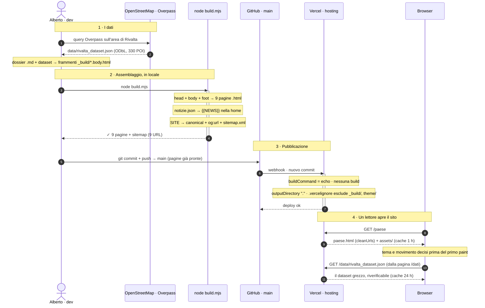

<div align="center">

# Rivalta sul Mincio — dossier informativo del paese

**Sito statico, zero dipendenze** — il dossier completo di **Rivalta sul Mincio**
(frazione del Comune di Rodigo, provincia di Mantova): anagrafica, servizi, attività,
comunità, viabilità, natura, eventi. Nove pagine di HTML puro, generate da un
assemblatore di 142 righe, vestite con il design system **`.sb-`** di
[albertopecchini.it](https://albertopecchini.it) — palette neutra, un solo verde,
tema chiaro/scuro nativo.

<!-- ─────────────  METRICHE LIVE (shields.io → GitHub API, auto-aggiornanti)  ───────────── -->

[](https://github.com/albertoxpecchini/rivaltasulmincio/commits/main)
[](https://github.com/albertoxpecchini/rivaltasulmincio/pulse)
[](https://github.com/albertoxpecchini/rivaltasulmincio)
[](https://github.com/albertoxpecchini/rivaltasulmincio)
[](https://github.com/albertoxpecchini/rivaltasulmincio)
[](https://github.com/albertoxpecchini/rivaltasulmincio)
[](https://github.com/albertoxpecchini/rivaltasulmincio/tree/main/assets)

<!-- ─────────────  STACK (badge statici: qui non c'è un package.json da rispecchiare)  ───────────── -->

[](index.html)
[](assets/sb.css)
[](assets/rivalta.js)
[](build.mjs)
[](#-comè-fatto)
[](https://www.openstreetmap.org/copyright)
[](https://vercel.com)

🔗 **Live:** [www.rivaltasulmincio.it](https://www.rivaltasulmincio.it) · **Repo:** [albertoxpecchini/rivaltasulmincio](https://github.com/albertoxpecchini/rivaltasulmincio) · **Autore:** [@albertoxpecchini](https://github.com/albertoxpecchini)

</div>

---

## 📊 Il progetto in numeri

> I badge di metrica derivano dall'API GitHub e si ricalcolano a ogni `git push`.
> La tabella qui sotto è misurata sull'albero al momento della scrittura.

| Dominio | Valore | Dettaglio |
| :--- | :--- | :--- |
| **Pagine pubblicate** | **9** | 3.954 righe di HTML **generato**, indirizzi senza estensione |
| **Sorgenti in `_build/`** | **2.181 righe** | 9 frammenti di contenuto + guscio (`head.html` · `foot.html`) |
| **Design system** | **1.433 righe CSS** | `sb.css` (836) · `rivalta.css` (411) · `controlbar.css` (186) |
| **JavaScript** | **783 righe**, 3 file | `rivalta.js` (91) · `controlbar.js` (364) · `glass.js` (328) |
| **Build** | **142 righe**, `build.mjs` | zero dipendenze, solo la libreria standard di Node |
| **Dipendenze** | **0** runtime, **0** dev | niente `package.json`, niente `node_modules` |
| **Dataset OSM** | **330 POI** su 10.191 righe JSON | 74 strade · 92 elementi stradali · 106 incroci · 16 corsi d'acqua |
| **Numeri civici** | **177** su **21 vie** | mappati in OpenStreetMap, non un archivio anagrafico |
| **Dossier sorgente** | **1.044 righe** Markdown | `data/rivalta-sul-mincio-dossier.md` |
| **Cronologia** | **167 commit** dal 2026-05-09 | repo creato il 2026-04-26 |

---

## 🏗️ Com'è fatto

HTML statico puro. Nessuna dipendenza, nessun framework, nessun build step in produzione: si serve
la cartella così com'è.

Gli indirizzi pubblici **non hanno estensione**: `/paese`, non `/paese.html`. I file su disco si
chiamano ancora `paese.html` — è `"cleanUrls": true` in [`vercel.json`](vercel.json) che li serve senza, e che manda
un **redirect 308** dal vecchio indirizzo al nuovo, così i link già in giro e quello che è stato
indicizzato non si rompono. I link interni si scrivono root-assoluti (`/paese`, `/` per la home).

### Modificare il sito

Le nove pagine `.html` in radice sono **generate**: le modifiche vanno fatte in [`_build/`](_build/), poi

```bash
node build.mjs
```

Nove pagine condividono la stessa nav e lo stesso footer. Tenerne nove copie a mano significa che
prima o poi otto sono aggiornate e una no, ed è sempre quella che qualcuno apre.

Titolo e descrizione di ogni pagina stanno in testa al rispettivo frammento, come due commenti —
così il contenuto e i suoi metadati non possono separarsi:

```html
<!--title: Servizi — Rivalta sul Mincio-->
<!--desc: Comune e sportelli, farmacia e salute…-->
```

Per aggiungere una pagina basta creare `_build/nuova.body.html` con quei due commenti e rilanciare
il build; la voce nella nav va aggiunta a mano in [`_build/head.html`](_build/head.html) e [`_build/foot.html`](_build/foot.html).

---

## 🧭 Le nove pagine

Un solo dominio, un indirizzo per pagina, la home alla radice. La nav è la stessa ovunque perché
esiste in copia unica in [`_build/head.html`](_build/head.html).

| Indirizzo | Frammento | Priorità | Cosa c'è |
| :--- | :--- | :---: | :--- |
| `/` | `index.body.html` | 1.0 | Il paese in sintesi + **«Rivalta sui giornali»** (rassegna stampa) |
| `/paese` | `paese.body.html` | 0.7 | Anagrafica, etimologia, dati ISTAT e demografia, edificato, monumenti |
| `/servizi` | `servizi.body.html` | 0.8 | Comune e sportelli, farmacia, banche, calendario rifiuti, fibra e 5G |
| `/attivita` | `attivita.body.html` | 0.8 | Alimentari, tabaccheria, bar e ristoranti, ricettività, mercato, aziende |
| `/comunita` | `comunita.body.html` | 0.7 | Scuole, Museo Etnografico dei Mestieri del Fiume, biblioteca, Pro Loco, sport |
| `/muoversi` | `muoversi.body.html` | 0.7 | Le 74 vie con fondo e limiti, dossi, 106 incroci, parcheggi, linea APAM 13 |
| `/natura` | `natura.body.html` | 0.7 | Parchi, Riserva Naturale Valli del Mincio, uso del suolo, ciclabili, navigazione |
| `/eventi` | `eventi.body.html` | 0.9 | Festa del Pesce, Sagra dei Patroni, Brusa la Vècia, Pulimincio, Cena Tedesca |
| `/dati` | `dati.body.html` | 0.4 | Fonti, metodo di misura, dataset JSON scaricabile, come rigenerarlo via Overpass |

---

## 🎨 Il design system `.sb-`

Non è un tema applicato sopra: [`assets/sb.css`](assets/sb.css) è un **estratto fedele** di
`src/app/home.css` di albertopecchini.it (blocco `.sb-home` e `html.dark .sb-home`). Token, misure e
primitive sono copiati dalla fonte di verità; cambia solo il contorno — lì è una SPA React con CSS
colocato per pagina, qui è un sito statico e il foglio è uno solo.

Le regole sono quelle del design system, non opinioni di questo repo:

- palette **neutra** (soli grigi) più **un'unica tinta**, il verde brand `hsl(153 60% 53%)`. Non si
  introduce un secondo colore vivo per distinguere qualcosa: si distingue con peso, spaziatura o bordo;
- ogni colore, ombra e bordo si scrive con `var(--sb-*)`. Gli unici valori letterali stanno nei due
  blocchi di token in cima a `assets/sb.css`;
- **un solo fondale** `position: fixed` per tutta la pagina. Nessuna sezione ha un bordo o uno
  sfondo proprio: fra una sezione e l'altra il contenuto scorre trasparente, senza righe di confine;
- niente reveal allo scroll, fade-in a cascata o contatori che partono entrando in viewport.
  Scorrere una pagina non è un evento da annunciare;
- tema chiaro/scuro **nativo**: `html.dark` ridichiara gli stessi token, non esiste un secondo
  foglio di stile.

Le superfici delle card non sono tinte piatte ma **lastre di vetro**: trasparenza (`--sb-glass-bg`),
sfocatura di ciò che sta dietro (`--sb-glass-blur`, con un pizzico di saturazione in più perché il
blur slava i colori) e filo di luce sul bordo alto (`--sb-glass-spec`), che è quello che il cervello
legge come «spessore».

Il tema è calcolato **prima del primo paint**, con uno script inline in `<head>`: senza, entrando su
una pagina che finirà scura si vedrebbe un lampo di bianco.

---

## 🌀 Movimento — il vetro, e solo su un gesto

Tutto il movimento sta in [`assets/glass.js`](assets/glass.js), separato da `rivalta.js` perché la
differenza è netta: `rivalta.js` fa **funzionare** il sito (menu, voce attiva, bordo della nav),
`glass.js` lo fa **sembrare fatto di vetro**. Se quel file non arriva — rete lenta, script bloccati,
JS spento — non manca niente di leggibile né di navigabile: le card restano dritte, il fondale
fermo, la nav con il suo hover di sempre. Ogni custom property scritta da lì ha un valore di
ripiego nel CSS.

- **Risponde a un gesto**: la card si inclina sotto il puntatore, la pillola della nav segue la
  voce, il fondale scorre di un dodicesimo. Niente di tutto questo parte da solo.
- **Il touch è escluso** — lì «hover» è il dito appoggiato un istante prima del tap, e una card che
  si inclina mentre si scorre è un difetto.
- **Un solo ascoltatore in delega** sul documento, non uno per card: le card sono qualche decina per
  pagina e la rassegna stampa le genera in build — con gli ascoltatori attaccati a mano una card
  nuova nascerebbe morta.
- **Niente letture di geometria dentro un gestore di evento** (misurare forza il browser a
  ricalcolare il layout, e su `pointermove` vuol dire una volta per frame): si misura all'ingresso,
  poi si usa quel numero. Si scrive nello stile solo dentro un `requestAnimationFrame`.
- Si accende e si spegne con il **tasto a stella nella barra**, e la scelta resta. Tre stati: senza
  scelta manuale comanda `prefers-reduced-motion` del sistema (e allora non si attacca nemmeno un
  ascoltatore); con la scelta fatta comanda il tasto, anche contro il sistema — una preferenza
  espressa qui è più recente e più specifica di quella del sistema operativo. In `localStorage`:
  `rsm-motion-mode` e `rsm-motion-manual`, classi `html.rsm-motion` / `html.rsm-still` scritte prima
  del primo paint.

---

## 🎛️ La barra di controllo

In basso a sinistra, fuori dal bordo, con la sola linguetta a vista: esce quando il puntatore le si
avvicina (130 px), quando il fuoco da tastiera entra, o premendo la linguetta — che sul touch è
l'unico modo. All'avvio si mostra un paio di secondi, così si sa che c'è. Dentro ci sono le tre
preferenze del sito: **tema**, **sensore orario**, **movimento**.

È portata da [`theme/`](theme/) (i sorgenti React di albertopecchini.it: `ControlBar.tsx`,
`ThemeWidget.tsx`, `themeCore.ts`, `controlbar.css`). Misure, curve e comportamento sono gli stessi;
è caduto solo il segmento della lingua, perché qui si parla italiano e basta, e al suo posto c'è il
tasto del movimento.

Il tema ha **due modi**, ed è la parte che vale la pena avere in testa:

- **auto** — il tema lo decide l'orologio: 08:00–19:59 chiaro, il resto scuro. Ai due confini cambia
  **da solo mentre la pagina è aperta**, con l'onda che parte un secondo prima (alle :59:59). Se la
  scheda è stata in secondo piano per ore, al risveglio (`visibilitychange`, `focus`) si riallinea
  invece di fidarsi di timer che il browser ha strozzato;
- **manuale** — vince il tasto, ma **solo fino al confine orario successivo**: lì il sensore si
  riprende il comando. Non è una svista, è il patto di «sempre e ovunque» — il sito di notte è scuro
  anche se stamattina qualcuno l'aveva schiarito. Il chip **Auto** restituisce il comando subito.

Ogni cambio di tema, a mano o dal sensore, passa dalla stessa **onda**: un cerchio tinto del tema in
arrivo si apre dal tasto premuto (o dal centro, se non l'ha premuto nessuno), il tema vero commuta a
corsa quasi finita — sotto la copertura — e il velo si dissolve rivelando la pagina già cambiata.
Cambiare tutti i colori a vista, insieme, è la cosa che fa sembrare rotto un sito che sta solo
cambiando tema. Con `prefers-reduced-motion` l'onda non parte: il tema cambia e basta.

---

## 🗂️ Struttura del repository

```
rivaltasulmincio/
├── index.html … dati.html      # le 9 pagine, GENERATE — non modificarle a mano
├── assets/
│   ├── sb.css                  #   design system .sb- (token + primitive da albertopecchini.it)
│   ├── rivalta.css             #   classi di pagina .sb-riv-* (tabelle, stat, note, indici)
│   ├── rivalta.js              #   bordo nav allo scroll, menu, voce attiva
│   ├── controlbar.css / .js    #   barra di controllo: tema, sensore orario, movimento
│   └── glass.js                #   movimento del vetro: card che si inclinano, parallasse, pillola
├── data/
│   ├── rivalta_dataset.json    #   l'estratto OpenStreetMap completo (ODbL) — 330 POI
│   └── …-dossier.md            #   il dossier sorgente in Markdown
├── _build/                     # l'officina: NON va online (.vercelignore)
│   ├── head.html               #   guscio: <head> + nav, con {{TITLE}} e {{DESC}}
│   ├── foot.html               #   guscio: footer + script
│   ├── <pagina>.body.html      #   il contenuto di ogni pagina (9 frammenti)
│   └── notizie.json            #   la rassegna stampa, resa al posto di {{NEWS}}
├── theme/                      # i sorgenti React di albertopecchini.it da cui è portata la barra
│                               #   (riferimento, NON serve al sito: non va online)
├── build.mjs                   # incolla guscio + contenuto, e genera sitemap.xml
├── sitemap.xml                 # GENERATO da build.mjs — non modificarlo a mano
├── robots.txt                  # statico, nessuna esclusione
└── vercel.json                 # framework null, cleanUrls, cache di assets/ e data/
```

---

## 🔀 Come funziona — il giro dei dati

Dalla **sorgente** (dossier, estratto OSM, frammenti HTML) alle **pagine generate** in locale, fino
al **deploy** su Vercel — che non costruisce niente, serve file.



| Dipendenza esterna | Uso | Dove |
| :--- | :--- | :--- |
| **OpenStreetMap / Overpass API** | l'estratto geodati del paese (ODbL) | a mano, in locale — non a runtime |
| **Google Fonts** | Titillium Web + Roboto Mono | client, con `preconnect` |
| **Vercel** | hosting statico, `cleanUrls`, header di cache | produzione |

Il sito **non chiama nessuna API a runtime**: quello che il browser scarica sono pagine, fogli di
stile, tre script e — solo su `/dati`, e solo se lo si chiede — il dataset.

---

## 🗺️ Dati e fonti

I geodati sono © **OpenStreetMap contributors**, licenza **ODbL**, estratti l'**11 agosto 2026**.
Le distanze sono in linea d'aria dal centro paese (45.18019 N, 10.67714 E), non stradali.

Dove il dossier in `data/` e il dataset grezzo divergono — numeri civici, parcheggi, barriere — **il
sito pubblica il dato grezzo**, perché è quello riverificabile aprendo
[`data/rivalta_dataset.json`](data/rivalta_dataset.json). La divergenza non è esposta al lettore: è
annotata qui.

Scelte editoriali da mantenere nelle prossime modifiche:

- **niente voci anonime fra le attività commerciali.** Un «parrucchiere senza nome a ~175 m» non
  serve a chi cerca un parrucchiere. Negozi, bar e locali entrano in elenco solo con un nome;
- **niente meta-commento sulla completezza dei dati.** Beni pubblici e naturali privi di nome
  proprio si nominano per quello che sono («Area verde di Via Garibaldi»), non si etichettano come
  non mappati;
- orari e recapiti restano da riverificare alla fonte prima di usi ufficiali — è detto una volta
  sola, in `/dati`, senza ripeterlo pagina per pagina.

---

## 📰 Aggiornare la rassegna stampa

La sezione «Rivalta sui giornali» in home si aggiorna da **[`_build/notizie.json`](_build/notizie.json)**, poi `node build.mjs`.
Le schede sono ordinate da sole per data decrescente.

```json
{
  "titolo": "il titolo esatto dell'articolo",
  "testata": "Gazzetta di Mantova",
  "data": "2026-07-06",              // ISO, serve solo a ordinare
  "dataTesto": "6 luglio 2026",      // quello che si legge nella scheda
  "nota": "luogo o date dell'evento", // fatti nostri, non frasi dell'articolo
  "url": "https://…"
}
```

**Regola da non violare: si pubblica solo il titolo, la testata, la data e il link.** Mai il testo
dell'articolo, mai la sua fotografia — nemmeno in hotlink. Un titolo con rimando è indicizzazione e
manda traffico alla testata; copiarne foto o corpo è riproduzione, ed è la parte che le testate
tutelano davvero. Il campo `nota` va scritto da noi e contiene solo fatti verificabili (date, luogo),
non una parafrasi del pezzo.

Le voci vanno verificate prima di pubblicarle: titolo e data si controllano aprendo l'articolo.

---

## 🔎 Sitemap e indicizzazione

`sitemap.xml` **è generato** da `build.mjs` insieme alle pagine, dalla stessa lista di frammenti: una
pagina nuova entra in sitemap da sé. Non modificarlo a mano — una sitemap scritta a mano è una
sitemap che prima o poi elenca un indirizzo che non esiste più, ed è peggio di non averla.

Il dominio di produzione sta in **una riga sola**, la costante `SITE` in cima a `build.mjs`. Da lì
escono sia il `<loc>` della sitemap sia il `<link rel="canonical">` e l'`og:url` di ogni pagina: se
non coincidessero al carattere, Search Console tratterebbe la stessa pagina come due. La home è
canonicalizzata sulla radice (`/`, non `/index`), o i motori indicizzerebbero due pagine identiche.

Priorità e frequenza si dichiarano nel frammento, con due commenti facoltativi (default `0.7` e
`monthly`):

```html
<!--prio: 0.9-->
<!--freq: weekly-->
```

`lastmod` è la data di ultima modifica **del frammento sorgente**, non di oggi: rigenerare il sito
senza aver cambiato niente non deve dire ai motori che tutte e nove le pagine sono state riscritte.

`robots.txt` è statico e non ha esclusioni: nove pagine pubbliche, nessuna area riservata.

---

## 🚀 Deploy (Vercel)

Il sito si serve così com'è: **su Vercel non gira nessuna build**. Le pagine si generano in locale con
`node build.mjs` e si committano già pronte.

[`vercel.json`](vercel.json) è quello che tiene in riga la piattaforma:

- `"framework": null` → preset **Other**. Il progetto era nato come SPA Vite e nelle impostazioni era
  rimasto il preset Vite: senza questa riga Vercel lancia `vite build` e fallisce con
  `vite: command not found` (exit 127), perché in questo repo Vite non esiste più;
- `"buildCommand"` e `"installCommand"` sono `echo` innocui. Devono essere **presenti**, non assenti:
  `vercel.json` ha la precedenza sulla dashboard, ma solo per i campi che dichiara — omettendoli
  tornerebbe a vincere il `vite build` salvato nelle impostazioni del progetto;
- `"outputDirectory": "."` → la radice del repo è già il sito;
- `"cleanUrls": true` → gli indirizzi non hanno estensione, e il vecchio `/paese.html` risponde con
  un redirect 308 su `/paese`;
- gli header di **cache**: `assets/` un'ora, `data/` un giorno, entrambi con `must-revalidate`.

[`.vercelignore`](.vercelignore) tiene fuori dal deploy l'officina (`_build/`, `build.mjs`,
`README.md`, `theme/`): online vanno solo le pagine, `assets/` e `data/`.

Il `cleanUrls` ha una conseguenza che era già costata una nota qui: l'evidenza della voce attiva
nella nav confronta il path con l'`href` dei link, e con gli indirizzi accorciati il confronto
letterale non torna più. Ora la funzione `pagina()` in [`assets/rivalta.js`](assets/rivalta.js) riduce entrambi al nome
della pagina — via lo slash iniziale, via l'estensione, `index` → vuoto — quindi il filo verde regge
sia su `/paese` sia su `/paese.html`, che è quello che vede chi arriva da un vecchio link prima che
il redirect scatti. **Se un giorno si toglie `cleanUrls`, quella funzione continua a funzionare:
non va disfatta.**

---

## 💻 Sviluppo locale

**Requisiti:** solo Node (per `build.mjs`, che usa la sola libreria standard). Niente `npm install`:
non c'è niente da installare.

```bash
git clone https://github.com/albertoxpecchini/rivaltasulmincio.git
cd rivaltasulmincio
node build.mjs    # rigenera le 9 pagine + sitemap.xml
npx serve .       # http://localhost:3000
```

Serve una qualsiasi cartella statica **che risolva gli indirizzi senza estensione** (`/paese` →
`paese.html`); `serve` lo fa da sé. Aprire i file con `file://` invece **non** funziona più: da
quando i link interni sono root-assoluti (`/paese`), con `file://` puntano alla radice del disco.
Serve un server, anche il più stupido.

---

## ♿ Accessibilità

Skiplink al contenuto (`Salta al contenuto`) · landmark semantici (`header` / `nav[aria-label]` /
`main` / `footer`) · `aria-current` sulla voce attiva, e la pillola che le scivola sotto è
`aria-hidden` perché non dice niente che `aria-current` non dica già meglio · barra di controllo
raggiungibile da tastiera (esce al `focus`) · **`prefers-reduced-motion` onorato**: senza una scelta
esplicita comanda il sistema, e allora non si attacca nemmeno un ascoltatore e l'onda del tema non
parte.

---

## 🎨 Palette

Verde brand identico nei due temi, grigi puri intorno. Tutti i valori letterali vivono nei due
blocchi di token in cima a [`assets/sb.css`](assets/sb.css); tutto il resto del foglio usa `var(--sb-*)`.

-3ECF8E?style=flat-square)


Carattere del sito: **Titillium Web** (+ Roboto Mono per il codice).

---

## 📄 Licenza e crediti

- **Geodati** — © **OpenStreetMap contributors**, licenza **[ODbL](https://opendatacommons.org/licenses/odbl/)**.
  Chi riusa `data/rivalta_dataset.json` deve mantenere l'attribuzione e la stessa licenza.
- **Design system `.sb-`** — portato da [albertopecchini.it](https://albertopecchini.it), codice sotto
  licenza **MIT** nel repo d'origine.
- **Testi del dossier e impaginazione** — © Alberto Pecchini. Le fonti istituzionali citate
  (Comune di Rodigo, ISTAT, Parco del Mincio, APAM) restano dei rispettivi titolari.
- **Rassegna stampa** — titoli, testate e link appartengono alle testate: qui c'è solo l'indice.

## 📬 Contatti

[](mailto:pzkko@yahoo.com)
[](https://github.com/albertoxpecchini)

<div align="center"><sub>Rivalta sul Mincio · Rodigo (MN) · <code>HTML statico, zero dipendenze</code></sub></div>
</content>
</invoke>
