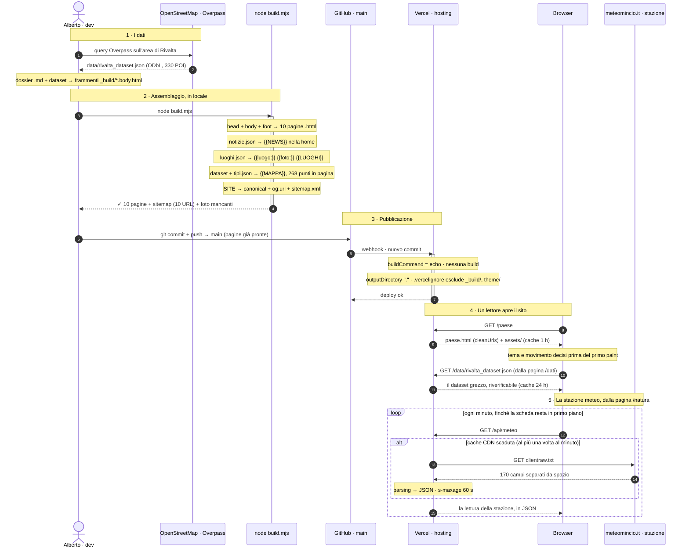

<div align="center">

# Rivalta sul Mincio — dossier informativo del paese

**Sito statico, zero dipendenze** — il dossier completo di **Rivalta sul Mincio**
(frazione del Comune di Rodigo, provincia di Mantova): anagrafica, servizi, attività,
comunità, viabilità, natura, storia, eventi, gastronomia e una mappa interattiva. Dodici pagine di HTML
puro, generate da un assemblatore di 260 righe, vestite con il design system **`.sb-`** di
[albertopecchini.it](https://albertopecchini.it) — palette neutra, un solo azzurro,
tema chiaro/scuro nativo.

<!-- ─────────────  METRICHE LIVE (shields.io → GitHub API, auto-aggiornanti)  ───────────── -->

[](https://github.com/albertoxpecchini/rivaltasulmincio/commits/main)
[](https://github.com/albertoxpecchini/rivaltasulmincio/pulse)
[](https://github.com/albertoxpecchini/rivaltasulmincio)
[](https://github.com/albertoxpecchini/rivaltasulmincio)
[](https://github.com/albertoxpecchini/rivaltasulmincio)
[](https://github.com/albertoxpecchini/rivaltasulmincio)
[](https://github.com/albertoxpecchini/rivaltasulmincio/tree/main/assets)

<!-- ─────────────  STACK (badge statici: qui non c'è un package.json da rispecchiare)  ───────────── -->

[](index.html)
[](assets/sb.css)
[](assets/rivalta.js)
[](build.mjs)
[](#-comè-fatto)
[](https://www.openstreetmap.org/copyright)
[](https://vercel.com)

🔗 **Live:** [www.rivaltasulmincio.it](https://www.rivaltasulmincio.it) · **Repo:** [albertoxpecchini/rivaltasulmincio](https://github.com/albertoxpecchini/rivaltasulmincio) · **Autore:** [@albertoxpecchini](https://github.com/albertoxpecchini)

</div>

---

## 📊 Il progetto in numeri

> I badge di metrica derivano dall'API GitHub e si ricalcolano a ogni `git push`.
> La tabella qui sotto è misurata sull'albero al momento della scrittura.

| Dominio | Valore | Dettaglio |
| :--- | :--- | :--- |
| **Pagine pubblicate** | **14** | HTML **generato**, indirizzi senza estensione |
| **Sorgenti in `_build/`** | 15 frammenti di contenuto + guscio (`head.html` · `foot.html`) | |
| **Design system** | **2.998 righe CSS** | `sb.css` (998) · `rivalta.css` (1.814) · `controlbar.css` (186) |
| **JavaScript nel browser** | **1.578 righe**, 7 file | `rivalta.js` (115) · `controlbar.js` (364) · `glass.js` (328) · `ricerca.js` (267) · `meteo.js` (214) · `mappa.js` (200) · `gusto.js` (90) |
| **JavaScript su server** | **221 righe**, 1 file | `api/meteo.mjs`, la sola cosa che non giri nel browser di chi legge |
| **Build** | **1.282 righe**, `build.mjs` | zero dipendenze, solo la libreria standard di Node |
| **Dipendenze** | **0** dev, **1** a runtime | Leaflet 1.9.4 ospitato in locale, caricato solo su `/mappa`. Niente `package.json` |
| **Cose da mangiare** | **18** | 9 voglie, 18 piatti e 15 locali in `_build/gusto.json` |
| **Luoghi censiti** | **152** | 65 luoghi + 87 attività in `_build/luoghi.json`, 123 con coordinate OSM |
| **Dataset OSM** | **330 POI** su 10.191 righe JSON | 74 strade · 92 elementi stradali · 106 incroci · 16 corsi d'acqua |
| **Numeri civici** | **177** su **21 vie** | mappati in OpenStreetMap, non un archivio anagrafico |
| **Dossier sorgente** | **1.044 righe** Markdown | `data/rivalta-sul-mincio-dossier.md` |
| **Cronologia** | **167 commit** dal 2026-05-09 | repo creato il 2026-04-26 |

---

## 🏗️ Com'è fatto

HTML statico. Nessuna dipendenza, nessun framework, nessun build step in produzione: si serve la
cartella così com'è.

L'unica cosa che gira su un server è [`api/meteo.mjs`](api/meteo.mjs), che legge la stazione meteo
del paese per la pagina `/natura` — sta lì perché il browser, da solo, quel file non può leggerlo. Si sveglia quando qualcuno apre la pagina e per il resto del tempo non esiste;
[più sotto](#la-stazione-meteo--lunica-cosa-che-gira-su-un-server) c'è il perché per esteso.

Gli indirizzi pubblici **non hanno estensione**: `/paese`, non `/paese.html`. I file su disco si
chiamano ancora `paese.html` — è `"cleanUrls": true` in [`vercel.json`](vercel.json) che li serve senza, e che manda
un **redirect 308** dal vecchio indirizzo al nuovo, così i link già in giro e quello che è stato
indicizzato non si rompono. I link interni si scrivono root-assoluti (`/paese`, `/` per la home).

### Modificare il sito

Le dodici pagine `.html` in radice sono **generate**: le modifiche vanno fatte in [`_build/`](_build/), poi

```bash
node build.mjs
```

Dodici pagine condividono la stessa nav e lo stesso footer. Tenerne dodici copie a mano significa che
prima o poi undici sono aggiornate e una no, ed è sempre quella che qualcuno apre.

Titolo e descrizione di ogni pagina stanno in testa al rispettivo frammento, come due commenti —
così il contenuto e i suoi metadati non possono separarsi:

```html
<!--title: Servizi — Rivalta sul Mincio-->
<!--desc: Comune e sportelli, farmacia e salute…-->
```

Per aggiungere una pagina basta creare `_build/nuova.body.html` con quei due commenti e rilanciare
il build; la voce nella nav va aggiunta a mano in [`_build/head.html`](_build/head.html) e [`_build/foot.html`](_build/foot.html).

---

## 🧭 Le dodici pagine

Un solo dominio, un indirizzo per pagina, la home alla radice. La nav è la stessa ovunque perché
esiste in copia unica in [`_build/head.html`](_build/head.html).

| Indirizzo | Frammento | Priorità | Cosa c'è |
| :--- | :--- | :---: | :--- |
| `/` | `index.body.html` | 1.0 | Il paese in sintesi + **«Rivalta sui giornali»** (rassegna stampa) |
| `/paese` | `paese.body.html` | 0.7 | Anagrafica, etimologia, dati ISTAT e demografia, edificato, monumenti |
| `/storia` | `storia.body.html` | 0.7 | Ripalta matildica, il castello e l'assedio del 1091, la nascita della valle, i mestieri del fiume |
| `/servizi` | `servizi.body.html` | 0.8 | Comune e sportelli, farmacia, banche, calendario rifiuti, fibra e 5G |
| `/attivita` | `attivita.body.html` | 0.8 | Alimentari, tabaccheria, bar e ristoranti, ricettività, mercato, aziende |
| `/mangiare` | `mangiare.body.html` | 0.9 | **«Cosa vuoi mangiare?»** — si sceglie la voglia, non il locale: 18 piatti, e chi li fa |
| `/comunita` | `comunita.body.html` | 0.7 | Scuole, Museo Etnografico dei Mestieri del Fiume, biblioteca, Pro Loco, sport |
| `/muoversi` | `muoversi.body.html` | 0.7 | Le 74 vie con fondo e limiti, dossi, 106 incroci, parcheggi, linea APAM 13 |
| `/natura` | `natura.body.html` | 0.7 | Parchi, Riserva Naturale Valli del Mincio, uso del suolo, ciclabili, navigazione |
| `/eventi` | `eventi.body.html` | 0.9 | Festa del Pesce, Sagra dei Patroni, Brusa la Vècia, Pulimincio, Cena Tedesca |
| `/mappa` | `mappa.body.html` | 0.9 | Mappa interattiva dei 268 punti d'interesse, filtri per categoria, registro dei luoghi |
| `/dati` | `dati.body.html` | 0.4 | Fonti, metodo di misura, dataset JSON scaricabile, come rigenerarlo via Overpass |

---

## 🎨 Il design system `.sb-`

Non è un tema applicato sopra: [`assets/sb.css`](assets/sb.css) è un **estratto fedele** di
`src/app/home.css` di albertopecchini.it (blocco `.sb-home` e `html.dark .sb-home`). Token, misure e
primitive sono copiati dalla fonte di verità; cambia solo il contorno — lì è una SPA React con CSS
colocato per pagina, qui è un sito statico e il foglio è uno solo.

Le regole sono quelle del design system, non opinioni di questo repo:

- palette **neutra** (soli grigi) più **un'unica tinta**, l'azzurro brand `hsl(197 100% 49%)`. Non si
  introduce un secondo colore vivo per distinguere qualcosa: si distingue con peso, spaziatura o bordo;
- ogni colore, ombra e bordo si scrive con `var(--sb-*)`. Gli unici valori letterali stanno nei due
  blocchi di token in cima a `assets/sb.css`;
- **un solo fondale** `position: fixed` per tutta la pagina. Nessuna sezione ha un bordo o uno
  sfondo proprio: fra una sezione e l'altra il contenuto scorre trasparente, senza righe di confine;
- niente reveal allo scroll, fade-in a cascata o contatori che partono entrando in viewport.
  Scorrere una pagina non è un evento da annunciare;
- tema chiaro/scuro **nativo**: `html.dark` ridichiara gli stessi token, non esiste un secondo
  foglio di stile.

Le superfici delle card non sono tinte piatte ma **lastre di vetro**: trasparenza (`--sb-glass-bg`),
sfocatura di ciò che sta dietro (`--sb-glass-blur`, con un pizzico di saturazione in più perché il
blur slava i colori) e filo di luce sul bordo alto (`--sb-glass-spec`), che è quello che il cervello
legge come «spessore».

Il tema è calcolato **prima del primo paint**, con uno script inline in `<head>`: senza, entrando su
una pagina che finirà scura si vedrebbe un lampo di bianco.

### Lo smusso — la forma di questo sito

È l'unico punto in cui Rivalta si stacca dal design system originale. Pillole, badge, indici,
filtri, lastre e tabelle **non sono stondati**: hanno l'angolo in alto a sinistra e quello in basso
a destra **tagliati a 45°**. Due diagonali opposte danno una direzione alla sagoma; tagliarne quattro
la rimetterebbe in simmetria e tornerebbe a essere un ottagono, cioè di nuovo un tondo.

Due misure sole, `--sb-cut: 10px` per gli elementi piccoli e `--sb-cut-lg: 18px` per le lastre, e
tre sagome pronte in `assets/sb.css`: `--sb-shape-sm`, `--sb-shape-lg`, `--sb-shape-lg-in`.

Tre cose da sapere prima di metterci mano:

- **Non accorparle in una sagoma sola con una misura variabile.** Le custom property vengono
  sostituite subito, sull'elemento dove sono scritte, e quello che eredita è il valore già risolto.
  Una `--sb-shape` che contenesse `var(--c)` cercherebbe `--c` su `.sb-home`, non lo troverebbe, e
  diventerebbe invalida — cioè vuota — prima ancora di arrivare a chi la usa.
- **`0.586px` non è un numero magico.** È di quanto va stretto il taglio interno perché fra le due
  diagonali della lastra resti esattamente 1px, come sui lati dritti: su una retta a 45° un pixel in
  perpendicolare vale √2 di scostamento, e 2 − √2 = 0.586. Arrotondarlo a 1px ingrossa la diagonale
  rispetto ai lati, e si vede.
- **`clip-path` taglia via anche il `box-shadow`.** Sulle lastre l'ombra esterna non può più essere
  un'ombra: `filter: drop-shadow()` la seguirebbe, ma un `filter` crea un *backdrop root* e
  spegnerebbe il `backdrop-filter` di tutto ciò che ha dentro — il vetro si smaterializzerebbe
  proprio al passaggio del mouse. Per le card cliccabili l'ombra è quindi **una seconda lastra**
  sfocata, appesa al contenitore `<a>` che non è ritagliato; in cambio segue lo smusso invece di
  arrotondarlo.

Sui lati dritti il contorno resta il `border`. Sulle due diagonali il clip lo porterebbe via, e si
ridisegna con due gradienti confinati nei quadrati d'angolo (`--sb-shape-edge`). Il `50%` degli stop
non è a occhio: su un quadrato di lato S la linea di taglio dista S/√2 dall'angolo, e l'asse di un
gradiente a 135° è lungo S·√2 — la metà esatta.

Restano stondati i bottoni (6px), la pillola scorrevole della nav e i pallini: la forma nuova
riguarda ciò che contiene, non ciò che si preme.

### Il testo è giustificato

Tutta la prosa del sito è `text-align: justify` con `hyphens: auto`. La sillabazione non è un vezzo:
le colonne sono strette (`max-width: 46rem`) e l'italiano ha parole lunghe — senza, la
giustificazione apre fiumi bianchi verticali che si vedono da lontano. Funziona perché `head.html`
dichiara `<html lang="it">` e il browser sillaba nella lingua del documento.

**Sotto i 480px torna a bandiera:** su una colonna da telefono fra una parola e l'altra si aprirebbero
voragini, e lì vince la leggibilità. Restano allineati a sinistra i dati (celle, intestazioni,
numeri) e tutto ciò che è centrato per scelta.

Non esiste una classe unica per il testo corrente — le pagine sono nate una alla volta e ogni
contesto si è portato dietro la sua — quindi il gruppo di selettori è elencato per esteso in cima a
`assets/rivalta.css`. **Se nasce una classe nuova che contiene un paragrafo, va aggiunta lì.**

---

## 🌀 Movimento — il vetro, e solo su un gesto

Tutto il movimento sta in [`assets/glass.js`](assets/glass.js), separato da `rivalta.js` perché la
differenza è netta: `rivalta.js` fa **funzionare** il sito (menu, voce attiva, bordo della nav),
`glass.js` lo fa **sembrare fatto di vetro**. Se quel file non arriva — rete lenta, script bloccati,
JS spento — non manca niente di leggibile né di navigabile: le card restano dritte, il fondale
fermo, la nav con il suo hover di sempre. Ogni custom property scritta da lì ha un valore di
ripiego nel CSS.

- **Risponde a un gesto**: la card si inclina sotto il puntatore, la pillola della nav segue la
  voce, il fondale scorre di un dodicesimo. Niente di tutto questo parte da solo.
- **Il touch è escluso** — lì «hover» è il dito appoggiato un istante prima del tap, e una card che
  si inclina mentre si scorre è un difetto.
- **Un solo ascoltatore in delega** sul documento, non uno per card: le card sono qualche decina per
  pagina e la rassegna stampa le genera in build — con gli ascoltatori attaccati a mano una card
  nuova nascerebbe morta.
- **Niente letture di geometria dentro un gestore di evento** (misurare forza il browser a
  ricalcolare il layout, e su `pointermove` vuol dire una volta per frame): si misura all'ingresso,
  poi si usa quel numero. Si scrive nello stile solo dentro un `requestAnimationFrame`.
- Si accende e si spegne con il **tasto a stella nella barra**, e la scelta resta. Tre stati: senza
  scelta manuale comanda `prefers-reduced-motion` del sistema (e allora non si attacca nemmeno un
  ascoltatore); con la scelta fatta comanda il tasto, anche contro il sistema — una preferenza
  espressa qui è più recente e più specifica di quella del sistema operativo. In `localStorage`:
  `rsm-motion-mode` e `rsm-motion-manual`, classi `html.rsm-motion` / `html.rsm-still` scritte prima
  del primo paint.

---

## 🎛️ La barra di controllo

In basso a sinistra, fuori dal bordo, con la sola linguetta a vista: esce quando il puntatore le si
avvicina (130 px), quando il fuoco da tastiera entra, o premendo la linguetta — che sul touch è
l'unico modo. All'avvio si mostra un paio di secondi, così si sa che c'è. Dentro ci sono le tre
preferenze del sito: **tema**, **sensore orario**, **movimento**.

È portata da [`theme/`](theme/) (i sorgenti React di albertopecchini.it: `ControlBar.tsx`,
`ThemeWidget.tsx`, `themeCore.ts`, `controlbar.css`). Misure, curve e comportamento sono gli stessi;
è caduto solo il segmento della lingua, perché qui si parla italiano e basta, e al suo posto c'è il
tasto del movimento.

Il tema ha **due modi**, ed è la parte che vale la pena avere in testa:

- **auto** — il tema lo decide l'orologio: 08:00–19:59 chiaro, il resto scuro. Ai due confini cambia
  **da solo mentre la pagina è aperta**, con l'onda che parte un secondo prima (alle :59:59). Se la
  scheda è stata in secondo piano per ore, al risveglio (`visibilitychange`, `focus`) si riallinea
  invece di fidarsi di timer che il browser ha strozzato;
- **manuale** — vince il tasto, ma **solo fino al confine orario successivo**: lì il sensore si
  riprende il comando. Non è una svista, è il patto di «sempre e ovunque» — il sito di notte è scuro
  anche se stamattina qualcuno l'aveva schiarito. Il chip **Auto** restituisce il comando subito.

Ogni cambio di tema, a mano o dal sensore, passa dalla stessa **onda**: un cerchio tinto del tema in
arrivo si apre dal tasto premuto (o dal centro, se non l'ha premuto nessuno), il tema vero commuta a
corsa quasi finita — sotto la copertura — e il velo si dissolve rivelando la pagina già cambiata.
Cambiare tutti i colori a vista, insieme, è la cosa che fa sembrare rotto un sito che sta solo
cambiando tema. Con `prefers-reduced-motion` l'onda non parte: il tema cambia e basta.

---

## 🗂️ Struttura del repository

```
rivaltasulmincio/
├── index.html … mappa.html     # le pagine, GENERATE — non modificarle a mano
├── assets/
│   ├── sb.css                  #   design system .sb- (token + primitive da albertopecchini.it)
│   ├── rivalta.css             #   classi di pagina .sb-riv-* (tabelle, stat, note, indici, testata, ricerca)
│   ├── rivalta.js              #   bordo nav allo scroll, menu, voce attiva, «aggiornato» in forma relativa
│   ├── ricerca.js              #   la tendina «Cerca» in testata (/ o ⌘K); legge l'indice qui sotto
│   ├── ricerca-dati.js         #   GENERATO da build.mjs: l'indice di ricerca di tutte le pagine
│   ├── controlbar.css / .js    #   barra di controllo: tema, sensore orario, movimento
│   ├── glass.js                #   movimento del vetro: card che si inclinano, parallasse, pillola
│   ├── mappa.js                #   monta Leaflet e i 268 segnaposto — solo su /mappa
│   ├── gusto.js                #   i tasti delle voglie — solo su /mangiare
│   ├── favicon.svg             #   la sagoma smussata del sito, col Mincio dentro — fa anche da marchio in testata
│   ├── loghi/                  #   i marchi: ap.png (firma), comune-rodigo, anspi
│   ├── foto/                   #   le fotografie: <slug>.jpg, le attività in foto/attivita/
│   └── vendor/leaflet/         #   Leaflet 1.9.4 ospitato qui, nessuna CDN
├── api/                        # le cose che NON girano nel browser di chi legge
│   ├── meteo.mjs               #   la stazione di meteomincio, tradotta in JSON
│   ├── iscrizione-color-walk.mjs   #   registra l'iscrizione: apre il pagamento, oppure
│   │                           #   la segna da pagare al ritrovo. E verifica il ritorno
│   ├── conferma-color-walk.mjs     #   il webhook PayPal: incassa e manda ricevuta o avviso
│   ├── iscritti-color-walk.mjs     #   l'elenco per chi organizza, e il tasto «incassato»
│   ├── _paypal.mjs             #   la porta verso PayPal, e il formato di un'iscrizione
│   └── _posta.mjs              #   le mail: come si compongono e da dove escono
│                               #   (in coda ha un blocco GENERATO da build.mjs: i modelli)
│                               #   il trattino basso dice a Vercel di non farne endpoint
├── data/
│   ├── rivalta_dataset.json    #   l'estratto OpenStreetMap completo (ODbL) — 330 POI
│   └── …-dossier.md            #   il dossier sorgente in Markdown
├── _build/                     # l'officina: NON va online (.vercelignore)
│   ├── head.html               #   guscio: <head> + nav, con {{TITLE}} e {{DESC}}
│   ├── foot.html               #   guscio: footer + script
│   ├── <pagina>.body.html      #   il contenuto di ogni pagina (15 frammenti)
│   ├── notizie.json            #   la rassegna stampa, resa al posto di {{NEWS}}
│   ├── luoghi.json             #   il registro dei 152 luoghi: coordinate, foto, schede
│   ├── gusto.json              #   il registro del gusto: voglie, piatti e chi li fa (/mangiare)
│   ├── tipi.json               #   tipi OSM → etichetta italiana e gruppo di filtro
│   └── email/                  #   le due mail della Color Walk, sorgente
│       ├── ricevuta-color-walk.html   #     a chi ha pagato E a chi paga al ritrovo
│       ├── fallita-color-walk.html    #     a chi si è fermato a metà
│       └── evento.json                  #     ritrovo, distanza, rimborsi: da compilare
├── theme/                      # i sorgenti React di albertopecchini.it da cui è portata la barra
│                               #   (riferimento, NON serve al sito: non va online)
├── build.mjs                   # incolla guscio + contenuto, genera sitemap.xml, ricerca-dati.js e le due mail
├── serve.mjs                   # anteprima locale con cleanUrls (non va online)
├── prova-conferma.mjs          # `npm test`: 15 casi sulle mail, con PayPal finto (non va online)
├── prova-invio.mjs             # manda una mail vera a sé stessi, per guardarla (non va online)
├── sitemap.xml                 # GENERATO da build.mjs — non modificarlo a mano
├── robots.txt                  # statico, nessuna esclusione
└── vercel.json                 # framework null, cleanUrls, cache di assets/ e data/
```

---

## 🔀 Come funziona — il giro dei dati

Dalla **sorgente** (dossier, estratto OSM, frammenti HTML) alle **pagine generate** in locale, fino
al **deploy** su Vercel — che non costruisce niente, serve file.



| Dipendenza esterna | Uso | Dove |
| :--- | :--- | :--- |
| **OpenStreetMap / Overpass API** | l'estratto geodati del paese (ODbL) | a mano, in locale — non a runtime |
| **Google Fonts** | Titillium Web + Roboto Mono | client, con `preconnect` |
| **Piastrelle OpenStreetMap** | il fondo della mappa (ODbL, con attribuzione) | client, **solo su `/mappa`** |
| **meteomincio.it** | la lettura della stazione di Rivalta | server, via `/api/meteo`, per la home e `/natura` |
| **Vercel** | hosting statico + quattro funzioni, `cleanUrls`, header di cache | produzione |
| **PayPal** | l'incasso della quota Color Walk, e il registro delle iscrizioni (una fattura ciascuna) | server, via `/api/iscrizione-color-walk`, `/api/conferma-color-walk` e `/api/iscritti-color-walk` |
| **Resend** | la spedizione delle due mail della Color Walk | server, via `/api/conferma-color-walk` |

Quello che il browser scarica sono pagine, fogli di stile, gli script e — solo se lo si chiede — il
dataset da `/dati`. Le chiamate a runtime sono **due**: `/mappa` scarica le piastrelle da
`tile.openstreetmap.org` mentre la si esplora (i 268 segnaposto, invece, sono già dentro la
pagina), e la stazione meteo viene chiesta a `/api/meteo` dalle due pagine che la mostrano — la
home e `/natura`. Le altre otto non parlano con nessuno.

### La stazione meteo — l'unica cosa che gira su un server

A Rivalta c'è una stazione vera, gestita col Centro Meteorologico Lombardo, che pubblica le proprie
letture su [meteomincio.it](https://www.meteomincio.it) in `clientraw.txt` — il formato standard di
Weather Display: una riga, 170 campi separati da spazio, posizione fissa. Il file viene riscritto
**ogni venticinque secondi circa**, e quello che si legge è vecchio di una cinquantina: «aggiornato
al minuto» è esattamente quanto questa fonte può dare, e la pagina non promette di più.

Il loro server però non manda `Access-Control-Allow-Origin`, quindi il browser di chi legge questo
sito non può aprire quel file da sé. Da qui [`api/meteo.mjs`](api/meteo.mjs), **la sola riga di
codice del progetto che non giri nel browser di chi legge**: sta in mezzo, traduce i 170 campi in
JSON con i nomi delle cose, e risponde con `s-maxage=60`. È la CDN di Vercel a servire quella
risposta a tutti, quindi meteomincio viene interrogato **al massimo una volta al minuto** — mille
lettori o uno solo, per il loro server non cambia niente.

Non c'è nessun cron e nessuna macchina accesa: la funzione si sveglia quando qualcuno apre una
delle due pagine, e se non le apre nessuno non succede niente. Se la stazione tace, la funzione
risponde `503` e la pagina tiene a schermo l'ultima lettura buona dicendo di quando è — un dato
vecchio ma dichiarato è utile, un dato inventato no.

Gli indici dei campi in `CAMPI` sono verificati contro `ajaxWDwx3.js`, lo script con cui
meteomincio legge il proprio cruscotto: sono gli stessi numeri che leggono loro. **È l'unico punto
del sito che dipende dal formato di qualcun altro**, e se un giorno smettesse di funzionare è lì che
si guarda.

#### «Prossimamente» — come si toglie

La sezione è **in prova**, e lo dice: sopra i dati, in tutte e due le pagine, c'è una pillola
`Prossimamente` e — dove c'è spazio — la riga che spiega perché. Non è un segnaposto: i numeri
sotto sono veri e in diretta. È in attesa del via libera di chi la stazione la gestisce, a cui la
richiesta è stata mandata dal loro modulo di contatto.

La barra sta **dentro** il blocco dei dati, non sopra: il blocco nasce `hidden` e lo scopre lo
script solo a lettura arrivata, e una barra messa fuori resterebbe lì da sola ad annunciare una
cosa che non si vede.

Quando la risposta arriva, si tolgono le due chiamate a `renderProssimamente()` in
[`build.mjs`](build.mjs), si rigenera, e non resta traccia di niente. Se la risposta fosse no, si
tolgono invece i segnaposto `{{METEO}}` da `_build/natura.body.html` e `{{METEO_ORA}}` da
`_build/index.body.html`: il sito torna esattamente com'era e la funzione resta in cartella senza
fare niente.

#### Le due forme

Le pagine che la mostrano sono due, e mostrano cose diverse perché servono momenti diversi.

In fondo a **`/natura`** c'è la griglia estesa: quattro numeri grandi e dieci misure di contorno,
per chi la stazione la stava cercando. Nella **hero della home**, a destra del titolo, c'è la
scheda `Ora a Rivalta`: gradi, che tempo fa, minima e massima, e le tre misure che cambiano la
giornata — umidità, vento, pioggia. Quanto basta a decidere se prendere la giacca; il resto sta a
un click.

Il campo 48 del formato è un numero da 0 a 37 con cui la stazione dichiara la condizione in corso.
[`api/meteo.mjs`](api/meteo.mjs) lo traduce in un nome italiano e in una chiave, e
[`assets/meteo.js`](assets/meteo.js) disegna la figura corrispondente: **undici SVG scritti in
linea**, con lo stesso tratto delle altre icone del sito. Sono in linea e non in un file di
immagini perché così prendono il colore dal testo — passano da sole al tema scuro, e una notte
serena non resta azzurra su fondo nero perché il `.svg` era stato salvato azzurro.

Nessuna delle figure ne copre un'altra. Il primo tentativo faceva passare la nuvola davanti al
sole riempiendola del colore del fondo: funzionava sul foglio di prova e sarebbe stato sbagliato in
pagina, perché la scheda sta su una lastra di vetro traslucida e non sul fondo — la toppa si
sarebbe vista come una macchia chiara dentro la nuvola. Ora l'astro sta in alto a destra e la
nuvola in basso a sinistra, senza toccarsi.

Un solo script serve tutte e due le forme, e non le conosce: cerca gli elementi che dichiarano
`data-meteo` e ci scrive il campo che chiedono. Una terza forma, un domani, non richiede una riga
in più lì dentro.

### La Color Walk — l'iscrizione che incassa davvero

La seconda cosa che non gira nel browser di chi legge. `/color-walk` raccoglie i dati di chi si
iscrive alla camminata a colori del 20 settembre e ne incassa la quota: **10 €** per chi ha 18 anni
o più, **5 €** per ogni ragazzo dai 6 ai 17 anni. Un'iscrizione è un gruppo — un maggiorenne più i
minori che porta con sé — e si paga in un colpo solo. Nessuna riga di commissioni da nessuna parte:
sono un costo dell'organizzazione, non una voce a carico di chi si iscrive. La pagina **non sta nel
menu** — le nove porte d'ingresso sono quelle e restano nove — ma è pubblica: la richiamano la home,
`/comunita` e `/eventi`, ed entra in sitemap.

#### Due modi di pagare, un solo registro

Si può pagare **subito online**, oppure **in contanti al ritrovo** — davanti alla chiesa alle 15:30,
al banchetto delle iscrizioni, prima della partenza. La scelta cambia solo quello che succede dopo
l'invio del modulo. L'iscrizione, in tutti e due i casi, è registrata nello stesso momento e nello
stesso posto.

Quel posto è una **fattura PayPal**, e la scelta merita di essere spiegata perché non è ovvia.
Prima, con Stripe, l'elenco degli iscritti *era* la lista dei pagamenti nel dashboard, con i campi
del modulo dentro i `metadata`: niente database, niente seconda copia dei dati di persone vere da
tenere al sicuro. **PayPal non ha un'API che elenca gli ordini**, quindi quel posto lì non esiste
più. Le fatture sì: si elencano, si filtrano, hanno campi larghi, e «non ancora pagata» è uno stato
che hanno già — mentre un pagamento o c'è o non c'è, ed è esattamente la differenza che serviva per
il contante.

| | quando nasce la fattura | come resta |
| :--- | :--- | :--- |
| paga online | alla compilazione del modulo | non saldata finché l'incasso non arriva; poi saldata, metodo PayPal |
| paga al ritrovo | alla compilazione del modulo | **non saldata**, finché qualcuno non incassa i contanti al banchetto |

Le fatture non vengono mai mandate a chi si iscrive: si creano, si «spediscono» con
`send_to_recipient: false` — che è il modo di portarle allo stato in cui accettano un pagamento
senza che PayPal scriva a nessuno — e le mail restano le nostre. Chi si iscrive non deve ricevere
due messaggi diversi dallo stesso evento.

Nascere prima del pagamento ha una conseguenza che va detta: **chi apre il checkout e non arriva in
fondo lascia una fattura non saldata**. Non è un rifiuto in mezzo ai piedi — è esattamente il
«pagamento non completato» che `/iscritti` contava già anche prima, e il memo della fattura dice
quale delle due cose è, perché ci porta scritto il modo di pagare scelto al momento del modulo.

#### Le funzioni

[`api/_paypal.mjs`](api/_paypal.mjs) parla con l'API REST di PayPal via `fetch`, **senza SDK**:
stesso zero-dipendenze del resto del sito, stesso stile di `api/meteo.mjs`. Tiene la porta verso
PayPal e — soprattutto — il **formato** con cui un'iscrizione ci sta dentro: una voce di fattura per
persona (`A|nome|cognome|data di nascita|codice fiscale`), e telefono, note e ora del consenso nel
memo riservato, che chi si iscrive non vede mai. Sta in un posto solo perché il formato con cui
un'iscrizione viene scritta è lo stesso con cui va riletta: il giorno che si dividono, l'elenco
smette di combaciare con quello che l'iscrizione ha scritto, e nessuno se ne accorge finché non
manca qualcuno davanti alla chiesa. Il trattino basso davanti al nome dice a Vercel di non farne un
endpoint.

[`api/iscrizione-color-walk.mjs`](api/iscrizione-color-walk.mjs) fa due mestieri secondo il metodo:

| | |
|---|---|
| `POST` | il modulo manda i dati di chi si iscrive, quelli dei minori che porta, il consenso spuntato e come intende pagare. Nasce la fattura; poi, se paga online, nasce l'ordine e la risposta è l'indirizzo a cui mandare il browser — se paga al ritrovo la risposta è «sei iscritto», e la mail parte subito |
| `GET ?ordine=…` | al ritorno dal pagamento: **incassa** e poi dice alla pagina com'è andata |

[`api/conferma-color-walk.mjs`](api/conferma-color-walk.mjs) non lo chiama il sito: lo chiama
PayPal. È il webhook che incassa e manda le mail.

[`api/iscritti-color-walk.mjs`](api/iscritti-color-walk.mjs) è l'elenco per chi organizza, dietro la
sola porta chiusa a chiave del sito, e in più il **tasto «incassato»**: il gesto del banchetto, con
il telefono in una mano e i soldi nell'altra. Segna la fattura saldata, metodo contanti. Si potrebbe
fare anche dall'app PayPal — ma sui gradini della chiesa il bottone vince.

Il `GET` di verifica esiste perché l'indirizzo di ritorno lo digita chiunque: senza quel controllo
basterebbe aprire `/color-walk?stato=ok` per vedersi dire «iscrizione ricevuta» senza aver pagato
una lira. Chi ha pagato torna anche con l'identificativo dell'ordine — che non si indovina, e che
PayPal aggiunge da sé come `token` — ed è quello, non la parola `ok`, a decidere cosa la pagina
scrive.

##### Incassare è un passaggio a parte

PayPal, quando chi paga approva, **non prende ancora niente**: l'ordine resta approvato e i soldi si
muovono solo quando glielo si chiede. A chiederlo sono in due — la pagina al ritorno e il webhook —
e non è una svista: al ritorno dal pagamento non ci si torna sempre. Se a incassare fosse solo la
pagina, chi ha approvato avrebbe autorizzato un pagamento che non arriva mai; se fosse solo il
webhook, chi torna resterebbe a guardare «un momento…». Che ci provino tutti e due è sicuro perché
la seconda volta PayPal risponde `ORDER_ALREADY_CAPTURED`, che non è una brutta notizia: è la
conferma che i soldi sono già stati presi. Una volta sola, comunque vada.

#### Le mail — e perché non partono dalla pagina

Chi paga online riceve una **ricevuta**. Chi paga al ritrovo riceve **la stessa mail**, che però dice
a chiare lettere che **la quota non è ancora pagata** e quanto deve portare — è il punto di tutta
quella modalità: la differenza fra una persona che arriva con i contanti in mano e una coda di venti
che scoprono al banchetto di dover pagare. Chi comincia e non arriva in fondo riceve un avviso che
dice che **il pagamento non è andato a buon fine e che non gli è stato addebitato niente**. Nessuno
resta a chiedersi se è iscritto o no — che è l'unica cosa, dopo aver dato dieci euro, che si vuole
sapere.

La mail di chi paga online **non parte dalla pagina di ritorno**, e questa è la scelta che tiene in
piedi tutto il resto. Al ritorno non ci si torna sempre: si chiude la scheda, finisce la batteria,
il telefono perde campo mentre PayPal sta rimandando indietro il browser. Se la conferma dipendesse
da lì, chi ha pagato resterebbe senza. Parte invece da **PayPal che avvisa il server**, a incasso
concluso, indipendentemente da dove sia finito il browser. Quattro proprietà, ognuna col suo perché:

| | |
|---|---|
| **la mail giusta** | dell'avviso si prende **una cosa sola**, l'identificativo. Se ha pagato, e quanto, e per quale iscrizione, lo si va a chiedere a PayPal. Un avviso falso, anche perfettamente firmato, al massimo nomina un incasso: se quell'incasso non risulta completato, non esce niente |
| **la firma** | la verifica PayPal stesso, a cui si rimanda l'avviso con le cinque intestazioni con cui è arrivato e `PAYPAL_WEBHOOK_ID`. Il corpo si infila nella richiesta **tale e quale**, montando il JSON a mano: rileggere e riscrivere lo stesso JSON cambia ordine delle chiavi e spaziatura, e la firma è calcolata sui byte. È lo scoglio su cui si arena chiunque verifichi un webhook PayPal la prima volta — ed è anche perché `bodyParser` è spento |
| **una sola volta** | il segno di «fatto» non è un registro a parte: è **lo stato della fattura**. Una già saldata non fa ripartire la ricevuta, una già annullata non fa ripartire l'avviso. Serve perché lo stesso pagamento genera più avvisi, e perché i rinvii di PayPal sono fatti apposta per ripetersi |
| **prima o poi arriva** | se la spedizione fallisce la funzione risponde **500**, non 200: è il modo di dire a PayPal «rimandamelo». PayPal riprova fino a venticinque volte in tre giorni. Una chiave sbagliata o un servizio di posta giù diventano così una mail in ritardo invece di una mail persa |

La ricevuta parte **prima** che la fattura venga segnata saldata, ed è voluto: al contrario, un
segno scritto e una spedizione fallita darebbero una mail che non parte più. Meglio il rischio
remoto di una copia in più che la certezza di uno zero.

L'avviso di mancato pagamento parte su **incasso rifiutato** e sui suoi parenti. Una carta rifiutata
mentre si è ancora sulle pagine di PayPal non fa partire niente: lì si ritenta subito, e una mail a
ogni tentativo sarebbe molestia. Chi ha poi pagato con un secondo tentativo non se lo vede arrivare:
prima di spedirlo la funzione guarda se a quell'indirizzo risulta un'iscrizione saldata, e se la
domanda non riesce a farla la mail **non parte** — dire per sbaglio «non sei iscritto» a chi ha
pagato è un danno, tacere è un'occasione persa. E chi paga al ritrovo non la riceve **mai**: la sua
quota non è «non andata a buon fine», è ancora da pagare.

> **Quello che PayPal non dice.** Chi apre il pagamento e chiude tutto senza approvare non genera
> nessun avviso: PayPal non ha un evento per gli ordini abbandonati, come invece c'era prima con
> `checkout.session.expired`. Quella persona non riceve nessuna mail, e la sua iscrizione resta fra
> le «non completate» che `/iscritti` conta. È una cosa in meno rispetto a prima, ed è scritta qui
> perché si sappia che manca.

##### Dove si scrivono

I due modelli stanno in [`_build/email/`](_build/email/) — HTML vero, che si apre nel browser per
guardarlo. Non sono scritti come una pagina del sito: la posta non è il web, e `var(--sb-*)`,
`color-mix()`, flex e grid in Outlook e Gmail non esistono. Stessa grammatica visiva del sito,
tecnica diversa: tabelle, stili in linea, i token di `assets/sb.css` risolti a mano in hex.

Due modelli e non tre: **la ricevuta è la stessa** per chi ha pagato e per chi paga al ritrovo, e i
pezzi che cambiano stanno dentro due marcatori condizionali che scioglie chi spedisce. Sono due mail
nello stesso file di proposito — il giorno che si corregge un orario o una frase, si corregge per
tutti e due; due file separati si sarebbero disallineati alla seconda modifica.

`node build.mjs` li compila **dentro** [`api/_posta.mjs`](api/_posta.mjs), fra due marcatori.
Sembra un giro largo, ed è il punto: `_build/` è in `.vercelignore`, quindi su Vercel quei file non
arrivano — compilati diventano due stringhe dentro un modulo, e non c'è niente che possa mancare
all'appello proprio mentre qualcuno sta pagando. Il blocco fra i marcatori è **generato**: si
modifica l'HTML in `_build/email/` e si rifà il build, mai il contrario.

I dati dell'evento — ritrovo, partenza, distanza, cosa portare, rimborsi, indirizzo degli
organizzatori — stanno in [`_build/email/evento.json`](_build/email/evento.json), perché cambiarli
non deve voler dire rimettere le mani dentro una mail. **Un campo lasciato vuoto non stampa una
parentesi quadra nella posta di qualcuno:** il build toglie via la sezione intera, e finché ritrovo e
cosa portare mancano al loro posto la ricevuta dice che i dettagli arrivano più avanti — che è la
verità. Ogni build stampa l'elenco di cosa manca ancora.

#### Le chiavi — le cose da mettere a mano

Le credenziali **non sono nel repository e non devono entrarci**. Vivono nelle variabili d'ambiente
su Vercel — **Settings → Environment Variables** — e ogni modifica va seguita da un **rideploy**: le
variabili le legge la funzione all'avvio, un deploy già fatto non le vede.

| Variabile | Dove si prende | Se manca |
| :--- | :--- | :--- |
| `PAYPAL_CLIENT_ID` | PayPal Developer → **Apps & Credentials** → l'app → *Client ID* | niente iscrizioni: la funzione risponde 502 senza provarci |
| `PAYPAL_CLIENT_SECRET` | la stessa scheda → *Secret key*. **Va rigenerata se è mai stata incollata da qualche parte**: una chiave che ha lasciato il pannello è una chiave bruciata | come sopra |
| `PAYPAL_AMBIENTE` | `prova` per la sandbox, qualunque altra cosa o niente per il conto vero | vale **live**: si incassa davvero |
| `PAYPAL_WEBHOOK_ID` | PayPal Developer → l'app → **Webhooks → Add webhook**, indirizzo `https://www.rivaltasulmincio.it/api/conferma-color-walk`, eventi `CHECKOUT.ORDER.APPROVED`, `PAYMENT.CAPTURE.COMPLETED`, `PAYMENT.CAPTURE.DENIED`, `PAYMENT.CAPTURE.REVERSED`, `CHECKOUT.ORDER.DECLINED` | gli avvisi vengono accettati **senza verificarne la firma** (quello che conta si rilegge comunque da PayPal, ma è un buco: nei log si vede) |
| `RESEND_API_KEY` | [resend.com](https://resend.com) → **API Keys**, dopo aver verificato il dominio `rivaltasulmincio.it` in **Domains** (record SPF e DKIM dal pannello DNS) | la funzione risponde 500 e PayPal **continua a riprovare per tre giorni**: appena la chiave c'è, le mail arretrate partono |
| `POSTA_MITTENTE` | facoltativa. Il mittente, forma `Nome <indirizzo@dominio>`. Il dominio dev'essere quello verificato in Resend | vale `Color Walk — Rivalta sul Mincio <color-walk@rivaltasulmincio.it>` |
| `ISCRITTI_CHIAVE` | la si sceglie: è la chiave che apre `/iscritti` | la zona iscritti risponde **503**. Una porta senza serratura si tiene chiusa, non spalancata |

##### Le prove

`npm test` fa girare i tre banchi — zero dipendenze, solo Node — con PayPal e la posta **finti**:
sessantadue casi, senza spedire niente a nessuno e senza toccare un pagamento vero.

```
node prova-conferma.mjs     le mail: quando partono, quale, e quando no
node prova-iscrizione.mjs   chi entra e a che prezzo, e i due modi di pagare
node prova-iscritti.mjs     la porta chiusa a chiave, l'elenco, il tasto «incassato»
```

Due casi vale la pena rileggerli. Un avviso con firma **valida** che dichiara un incasso riuscito
non fa uscire nessuna ricevuta, perché quel che decide è la risposta di PayPal all'interrogazione,
non quello che l'avviso racconta di sé. E chi ha scelto i contanti non riceve **mai** l'avviso di
mancato pagamento, per quanti rifiuti passino di lì.

Il webhook si prova poi senza aspettare un vero iscritto: in PayPal Developer, dalla scheda del
webhook, **Simulate webhook event**.

##### La prova che nessuna finzione può dare

`npm test` dice che le funzioni **decidono** giusto. Non dice che la mail **esce** e che in Gmail su
un telefono si vede come deve — quello lo dice solo una mail vera.
[`prova-invio.mjs`](prova-invio.mjs) ne manda una, a sé stessi, con dati inventati, senza toccare
PayPal né pagamenti né iscritti. Parte da una fattura finta e passa dalla stessa funzione che
compone le mail vere, importata e non ricopiata, quindi quello che si vede arrivare è esattamente
quello che arriverà a chi si iscrive:

```powershell
$env:RESEND_API_KEY = "re_…"
node prova-invio.mjs io@example.it             # la ricevuta di chi ha pagato
node prova-invio.mjs io@example.it contanti    # chi paga al ritrovo — deve dire che NON è pagata
node prova-invio.mjs io@example.it fallita     # l'avviso di mancato pagamento
```

**Va fatto girare prima che si iscriva qualcuno davvero**, e tutte e tre. Il modo tipico di sbagliare
è il mittente: in Resend si verifica spesso un sottodominio (`send.rivaltasulmincio.it`) mentre
`POSTA_MITTENTE` è rimasto sul dominio nudo, o viceversa — e allora Resend rifiuta con un 403 che da
solo non spiega niente. Qui e nei log di Vercel quel caso si dice per esteso, col mittente stampato
accanto. Ma è meglio scoprirlo con la propria casella che col primo che tira fuori la carta: fino a
quel momento il pagamento riuscirebbe comunque — l'incasso è di PayPal e non dipende dalla mail — e
la ricevuta arriverebbe in ritardo, quando la variabile è corretta e PayPal rimanda l'avviso.

Va infine compilato **`_build/email/evento.json`** con quello che il gruppo del Palio decide, a
partire da `organizzatori`: senza quell'indirizzo le mail partono senza un posto a cui rispondere,
e il piede che dice «rispondi pure a questo messaggio» promette una cosa che non c'è.

Le due quote stanno in **un punto solo**: `QUOTA_ADULTO_CENT` e `QUOTA_MINORE_CENT` in
[`api/_paypal.mjs`](api/_paypal.mjs) (in centesimi). Il testo di `_build/color-walk.body.html` le
ripete a parole per chi legge — se si cambiano i centesimi, va riallineato anche quello. Nelle mail
non sono ricopiate: la ricevuta mostra le voci della fattura, una per una, quello che è stato
davvero scritto nel registro.

---

## 🗺️ Dati e fonti

I geodati sono © **OpenStreetMap contributors**, licenza **ODbL**, estratti l'**11 agosto 2026**.
Le distanze sono in linea d'aria dal centro paese (45.18019 N, 10.67714 E), non stradali.

Dove il dossier in `data/` e il dataset grezzo divergono — numeri civici, parcheggi, barriere — **il
sito pubblica il dato grezzo**, perché è quello riverificabile aprendo
[`data/rivalta_dataset.json`](data/rivalta_dataset.json). La divergenza non è esposta al lettore: è
annotata qui.

Scelte editoriali da mantenere nelle prossime modifiche:

- **niente voci anonime fra le attività commerciali.** Un «parrucchiere senza nome a ~175 m» non
  serve a chi cerca un parrucchiere. Negozi, bar e locali entrano in elenco solo con un nome;
- **niente meta-commento sulla completezza dei dati.** Beni pubblici e naturali privi di nome
  proprio si nominano per quello che sono («Area verde di Via Garibaldi»), non si etichettano come
  non mappati;
- orari e recapiti restano da riverificare alla fonte prima di usi ufficiali — è detto una volta
  sola, in `/dati`, senza ripeterlo pagina per pagina.

---

## 📰 Aggiornare la rassegna stampa

La sezione «Rivalta sui giornali» in home si aggiorna da **[`_build/notizie.json`](_build/notizie.json)**, poi `node build.mjs`.
Le schede sono ordinate da sole per data decrescente. Le voci si scrivono a mano, una per
una: non c'è nessuna automazione che le peschi.

```json
{
  "titolo": "il titolo esatto dell'articolo",
  "testata": "Gazzetta di Mantova",
  "data": "2026-07-06",              // ISO, serve solo a ordinare
  "dataTesto": "6 luglio 2026",      // quello che si legge nella scheda
  "nota": "luogo o date dell'evento", // fatti nostri, non frasi dell'articolo
  "url": "https://…"
}
```

**Regola da non violare: si pubblica solo il titolo, la testata, la data e il link.** Mai il testo
dell'articolo, mai la sua fotografia — nemmeno in hotlink. Un titolo con rimando è indicizzazione e
manda traffico alla testata; copiarne foto o corpo è riproduzione, ed è la parte che le testate
tutelano davvero. Il campo `nota` va scritto da noi e contiene solo fatti verificabili (date, luogo),
non una parafrasi del pezzo.

Le voci vanno verificate prima di pubblicarle: titolo e data si controllano aprendo l'articolo.

---

## 📍 Il registro dei luoghi

**[`_build/luoghi.json`](_build/luoghi.json)** è l'anagrafe dei posti di cui il sito parla: **152
voci**, 65 luoghi e 87 attività. Un file solo, perché le stesse informazioni servono a tre cose che
altrimenti si scriverebbero tre volte e divergerebbero al primo cambiamento — i collegamenti alla
mappa, le fotografie e le schede della pagina `/mappa`.

```json
{
  "slug": "chiesa-santi-vigilio-donato",
  "nome": "Chiesa dei Santi Vigilio e Donato",
  "gruppo": "Luoghi di culto",
  "indirizzo": "Piazza Chiesa",
  "lat": 45.179933, "lon": 10.680703, "dist_m": 281,
  "pagina": "/paese#chiese",
  "foto": "chiesa-santi-vigilio-donato.jpg",
  "alt": "La facciata settecentesca della parrocchiale su Piazza Chiesa",
  "credito": null,
  "consenso": null
}
```

Le coordinate sono state prese dall'estratto OSM, non scritte a mano: **123 voci su 152** hanno un
punto. Le altre sono aree, percorsi o cose diffuse — il fiume, le capezzagne, le meridiane — che un
punto non ce l'hanno, e il cui collegamento ricade sulla ricerca per nome di OpenStreetMap.

### I tre segnaposto

Nei frammenti non si scrivono link a mano. `build.mjs` risolve tre segnaposto:

| Si scrive | Diventa |
| :--- | :--- |
| `{{luogo:corte-mincio-porto}}` | il nome del luogo, premibile, che apre OSM sul punto |
| `{{luogo:corte-mincio-porto\|Via Porto}}` | lo stesso, con un'etichetta diversa dal nome |
| `{{geo:45.18234,10.67681}}` | coordinate sciolte (dossi, autovelox, nodi STOP) |
| `{{foto:chiesa-santi-vigilio-donato}}` | la fotografia, **se il file esiste** |

Uno slug che non esiste **fa fallire il build**, come già succede a un frammento senza titolo: un
collegamento rotto scoperto in produzione costa più di un build che si ferma.

---

## 🍽 Il registro del gusto

**[`_build/gusto.json`](_build/gusto.json)** è la sorgente di `/mangiare`, la pagina che capovolge
`/attivita`: là c'è l'elenco dei locali, qui si parte dalla domanda che uno si fa davvero prima di
uscire di casa — **«cosa mi va?»** — e il locale arriva in fondo alla scheda, dopo aver detto che
cos'è il piatto e perché è di qui.

Il file contiene **9 voglie** (i tasti in cima alla pagina) e **18 piatti**. Ogni piatto dichiara a
quali voglie risponde e, sotto, chi lo fa:

```json
{
  "slug": "luccio-alla-rivaltese",
  "nome": "Luccio alla Rivaltese",
  "voglie": ["pesce", "mantovana", "scoperta"],
  "occhiello": "Il piatto che porta il nome del paese",
  "cose": "Luccio del Mincio lessato dieci-dodici minuti… *In salsa*: …",
  "perche": "Non è un piatto mantovano che a Rivalta si fa anche: è un piatto *di* Rivalta…",
  "quando": "Il luccio in bianco è tradizionalmente il piatto della vigilia di Pasqua…",
  "dove": [
    { "luogo": "ristorante-corte-catenaccio", "come": "*Luccio in salsa alla rivaltese con polenta abbrustolita*, in carta fra gli antipasti di pesce." }
  ]
}
```

`luogo` è uno **slug del registro dei luoghi**: nome, indirizzo, collegamento a OpenStreetMap e
rimando alla scheda arrivano da lì, esattamente come per `{{luogo:…}}`. Un locale che cambia
indirizzo si corregge in un posto solo. Uno slug che non esiste, una voglia che nessun piatto
nomina o una voglia dichiarata da un piatto e non esistente **fermano il build**: un tasto che apre
il vuoto è peggio di un tasto che non c'è.

In `cose`, `perche`, `quando` e `come` un `*asterisco per parte*` diventa grassetto. È l'unico
markup ammesso: tutto il resto è testo, e viene sfuggito.

### La regola che tiene in piedi la pagina

Un locale compare sotto un piatto **solo se quel piatto risulta da una fonte** — la carta del
locale, il suo sito, o l'ente che lo censisce. Non si deduce dalla categoria: «è un ristorante di
pesce, quindi avrà il luccio» qui non basta. Un elenco che indovina è peggio di un elenco corto, e
qui l'errore lo pagherebbe un ristoratore vero.

Il campo `fascia` è la **spesa indicativa a persona dichiarata dai portali di prenotazione**, non un
listino: sta nel file perché è la seconda domanda che uno si fa, ed è marcata come indicativa
dovunque compaia. Carte, prezzi e giorni di chiusura cambiano senza avvisare nessuno — è la parte
del sito che invecchia più in fretta.

`{{VOGLIE}}` nel frammento diventa la fila dei tasti più le schede. I tasti li filtra
[`assets/gusto.js`](assets/gusto.js), che la pagina scarica solo perché il segnaposto c'è: senza
JavaScript le schede sono comunque tutte in pagina, si legge tutto invece che a pezzi.

---

## 📷 Aggiungere una fotografia

Le fotografie si mettono in **`assets/foto/`** (le attività in `assets/foto/attivita/`) con
**esattamente** il nome file scritto nel campo `foto` del registro, poi `node build.mjs`.

Non serve toccare l'HTML: i segnaposto `{{foto:…}}` sono **già scritti** nelle pagine per tutte e 152
le voci. Finché il jpg non c'è, il segnaposto non produce niente — nessun buco, nessuna immagine
rotta. Il giorno che il file entra nella cartella, la figura compare da sé.

Il build dice a ogni giro a che punto siamo:

```
⚠ fotografie: 12 su 110. Ne mancano 98.
  parco-campino.jpg  parco-la-platana.jpg  fontana-della-madonna.jpg  …
```

**Formato:** 1600 × 1067 (3:2), JPEG qualità ~82, sotto i 250 kB. Le misure sono scritte
nell'attributo `width`/`height` dell'immagine, così la pagina non sobbalza mentre carica.

> **Le vetrine delle attività vogliono un permesso.** Fotografare dalla strada pubblica è una cosa,
> pubblicare la foto su un sito che presenta quell'attività è un'altra: serve l'ok del titolare, e
> l'insegna è un marchio. Chiederlo mentre si scatta è anche il modo più semplice per ottenere una
> foto migliore di quella fatta di sfuggita dal marciapiede. Il registro ha i campi `credito` e
> `consenso` per tenerne traccia.

---

## 🗺️ La mappa

`/mappa` monta **Leaflet 1.9.4**, ospitato in `assets/vendor/leaflet/` — nessuna CDN. È l'unica
dipendenza del progetto, pesa ~160 kB fra script e foglio, e **si carica solo su quella pagina**:
`build.mjs` inietta i tag se e solo se il frammento contiene `{{MAPPA}}`, così non c'è un elenco da
tenere aggiornato.

I 268 segnaposto **non si scaricano a runtime**: il build proietta il dataset in un blocco JSON
dentro la pagina (~33 kB invece di 10.191 righe). Il dataset cambia solo quando qualcuno rigenera
l'estratto OSM, cioè fra un deploy e l'altro: andarlo a chiedere a ogni caricamento vorrebbe dire
mostrare una mappa vuota a chi ha la linea lenta.

- **Un solo colore.** I segnaposto sono tutti azzurro brand, come vuole il design system; a
  distinguere le nove categorie sono il segno dentro la goccia e i filtri. I punti con un nome sono
  più grandi e pieni: nel riquadro ci sono 28 panchine e un museo, e non devono pesare uguale.
- **Tema scuro senza una seconda fonte.** Non esiste una piastrella scura ufficiale di OSM, quindi
  quella chiara si inverte in CSS (`invert` + `hue-rotate`), e il cambio tema dalla barra di
  controllo agisce sulla mappa senza che `mappa.js` ne sappia nulla.
- **Movimento fermo rispettato:** con `html.rsm-still` o `prefers-reduced-motion` Leaflet nasce
  senza animazioni di zoom e dissolvenza.
- **Senza JavaScript la pagina regge:** sotto la mappa c'è l'elenco completo dei 152 luoghi, ognuno
  con il suo collegamento a OpenStreetMap.

Le etichette italiane dei tipi OSM stanno in **[`_build/tipi.json`](_build/tipi.json)**, insieme al
gruppo di filtro. Se una rigenerazione del dataset porta tipi nuovi, il build li elenca e li lascia
fuori dalla mappa finché non vengono tradotti lì.

> **Cosa non finisce sulla mappa.** `tipi.json` marca `escluso: true` le **38 piscine** e i **23
> recinti per animali** censiti: sono quasi tutti dentro giardini di abitazioni private. Sono dati
> veri e restano nel dataset scaricabile — che è OpenStreetMap così com'è — ma una mappa puntuale di
> casa d'altri non è una funzione, è un problema. Fuori anche i tombini, per motivi meno gravi.

---

## 🔎 Sitemap e indicizzazione

`sitemap.xml` **è generato** da `build.mjs` insieme alle pagine, dalla stessa lista di frammenti: una
pagina nuova entra in sitemap da sé. Non modificarlo a mano — una sitemap scritta a mano è una
sitemap che prima o poi elenca un indirizzo che non esiste più, ed è peggio di non averla.

Il dominio di produzione sta in **una riga sola**, la costante `SITE` in cima a `build.mjs`. Da lì
escono sia il `<loc>` della sitemap sia il `<link rel="canonical">` e l'`og:url` di ogni pagina: se
non coincidessero al carattere, Search Console tratterebbe la stessa pagina come due. La home è
canonicalizzata sulla radice (`/`, non `/index`), o i motori indicizzerebbero due pagine identiche.

Priorità e frequenza si dichiarano nel frammento, con due commenti facoltativi (default `0.7` e
`monthly`):

```html
<!--prio: 0.9-->
<!--freq: weekly-->
```

`lastmod` è la data di ultima modifica **del frammento sorgente**, non di oggi: rigenerare il sito
senza aver cambiato niente non deve dire ai motori che tutte le pagine sono state riscritte.

`robots.txt` è statico e non ha esclusioni: solo pagine pubbliche, nessuna area riservata.

---

## 🔍 La ricerca in testata

Il tasto **Cerca** in testata (o il tasto `/`, o `⌘K` / `Ctrl K`) apre una tendina sopra la pagina:
si scrive, si scorre con le frecce, si apre con `Invio`, si chiude con `Esc` o toccando fuori.

L'indice **è generato** da `build.mjs` — come `sitemap.xml`, dalla stessa lista di frammenti — e
finisce in `assets/ricerca-dati.js` (`window.RSM_RICERCA`). Per ogni pagina pubblica: nome breve,
indirizzo, descrizione, e ogni sezione ancorata (l'etichetta la dà l'indice `.sb-riv-toc` in cima
alla pagina quando c'è, altrimenti il titolo `<h2>`; ci finiscono anche i pochi `<h3 id="…">`).
A ogni voce è allegato un pezzo del testo della sezione, **non mostrato, solo cercabile**: così
«autobus» porta a `/muoversi`, «meteo» a `/natura#stazione-meteo`, anche se la parola nel titolo
non c'è.

Nessuna chiamata di rete: l'indice è già nel browser, la ricerca funziona anche offline.
`assets/ricerca.js` è il comportamento (~26 kB l'indice, un file solo per tutte le pagine, in cache
dopo la prima). Senza JavaScript il tasto non compare e la navigazione a voci basta da sola.

## 🕔 «Ultimo aggiornamento»

La data dell'**ultimo commit** (`git log -1`, letta da `build.mjs`) è messa in testata, nel foglio
del menu su schermo stretto e in fondo a ogni pagina, con tre forme dallo stesso segnaposto:
`{{UPDATED_ISO}}` per `datetime`, `{{UPDATED_LONG}}` («26 agosto 2026») e `{{UPDATED_SHORT}}`
(«26 ago»). Con JavaScript `rivalta.js` la accorcia in forma relativa — «oggi», «ieri», «3 giorni
fa» — e sposta la data per esteso nel `title`. Fuori da un repo git il build ripiega su oggi.

---

## 🚀 Deploy (Vercel)

Il sito si serve così com'è: **su Vercel non gira nessuna build**. Le pagine si generano in locale con
`node build.mjs` e si committano già pronte.

[`vercel.json`](vercel.json) è quello che tiene in riga la piattaforma:

- `"framework": null` → preset **Other**. Il progetto era nato come SPA Vite e nelle impostazioni era
  rimasto il preset Vite: senza questa riga Vercel lancia `vite build` e fallisce con
  `vite: command not found` (exit 127), perché in questo repo Vite non esiste più;
- `"buildCommand"` e `"installCommand"` sono `echo` innocui. Devono essere **presenti**, non assenti:
  `vercel.json` ha la precedenza sulla dashboard, ma solo per i campi che dichiara — omettendoli
  tornerebbe a vincere il `vite build` salvato nelle impostazioni del progetto;
- `"outputDirectory": "."` → la radice del repo è già il sito;
- `"cleanUrls": true` → gli indirizzi non hanno estensione, e il vecchio `/paese.html` risponde con
  un redirect 308 su `/paese`;
- gli header di **cache**: `assets/` un'ora, `data/` un giorno, entrambi con `must-revalidate`.

[`.vercelignore`](.vercelignore) tiene fuori dal deploy l'officina (`_build/`, `build.mjs`,
`README.md`, `theme/`): online vanno solo le pagine, `assets/` e `data/`.

Il `cleanUrls` ha una conseguenza che era già costata una nota qui: l'evidenza della voce attiva
nella nav confronta il path con l'`href` dei link, e con gli indirizzi accorciati il confronto
letterale non torna più. Ora la funzione `pagina()` in [`assets/rivalta.js`](assets/rivalta.js) riduce entrambi al nome
della pagina — via lo slash iniziale, via l'estensione, `index` → vuoto — quindi il filo azzurro regge
sia su `/paese` sia su `/paese.html`, che è quello che vede chi arriva da un vecchio link prima che
il redirect scatti. **Se un giorno si toglie `cleanUrls`, quella funzione continua a funzionare:
non va disfatta.**

---

## 💻 Sviluppo locale

**Requisiti:** solo Node (per `build.mjs` e `serve.mjs`, che usano la sola libreria standard).
Niente `npm install`: non c'è niente da installare.

```bash
git clone https://github.com/albertoxpecchini/rivaltasulmincio.git
cd rivaltasulmincio
node build.mjs    # rigenera le 9 pagine + sitemap.xml
node serve.mjs    # http://localhost:8080 — Ctrl+C per fermare
```

[`serve.mjs`](serve.mjs) è l'anteprima locale: come `build.mjs`, sola libreria standard di Node e
niente da installare. La porta si cambia con `node serve.mjs 3000` (o `PORT=3000`).

Un server ci vuole per forza: aprire i file con `file://` **non** funziona più, perché da quando i
link interni sono root-assoluti (`/paese`) con `file://` puntano alla radice del disco. E deve
**risolvere gli indirizzi senza estensione** (`/paese` → `paese.html`), altrimenti in locale ogni
link interno dà 404 mentre in produzione funziona: `serve.mjs` riproduce apposta `"cleanUrls": true`
di `vercel.json`. Va bene anche `npx serve .` (porta 3000), che lo fa da sé, ma si tira dietro un
albero di dipendenze per una cosa che qui sono cinquanta righe.

### Provare le funzioni `api/` in locale — `npm run dev`

`serve.mjs` mostra le pagine; per provare anche le funzioni in `api/` c'è `npm run dev` (Vite:
`http://localhost:5174`, e in ascolto anche sull'indirizzo di rete `10.x`, così le pagine si aprono
dal telefono). Le funzioni leggono le chiavi da `process.env` — in produzione le mette Vercel, in
locale da un file **`.env`** in radice, che `git` ignora perché sono segreti:

```bash
cp .env.example .env      # poi riempire ISCRITTI_CHIAVE e le credenziali PayPal
npm run dev
```

Senza `.env`, `/iscritti` risponde «zona iscritti non configurata: manca `ISCRITTI_CHIAVE`» e non
si arriva nemmeno a digitare la chiave. In `.env` la chiave la si inventa: dev'essere solo la stessa
che si scrive nella porta della pagina. Una variabile già esportata nella shell vince sul file.

Superata la porta serve anche il resto, o l'elenco risponde 502 «PayPal non configurato»:
`PAYPAL_CLIENT_ID` e `PAYPAL_CLIENT_SECRET` — quelle della **sandbox**, non del conto vero — e
soprattutto `PAYPAL_AMBIENTE=prova`, perché senza quella riga vale `live` e si lavora sulle fatture
vere da un computer di casa. In produzione la chiave manca solo se qualcuno l'ha tolta da Vercel: lì
il 503 non è una configurazione da fare, è una serratura che è sparita.

Le credenziali di prova stanno in **PayPal Developer → Apps & Credentials → scheda Sandbox**, sulla
stessa app di sempre o su una creata lì per l'occasione; l'app di prova vuole la spunta
**Features → Invoicing** esattamente come quella vera, perché il registro degli iscritti *sono* le
fatture. Da lì il giro si chiude tutto in locale: si compila il modulo su `/color-walk`, nasce una
fattura nella sandbox, e `/iscritti` la mostra — codice identico alla produzione, soldi finti.

Una cosa sola resta fuori: la conferma del pagamento online. Arriva da un webhook, e PayPal a
`localhost` non ci bussa. In locale quindi un'iscrizione **in contanti** compare subito nell'elenco
come «da incassare» e il tasto «segna incassato» funziona per davvero; una pagata con PayPal, finché
il webhook non la conferma, resta fra le «a metà».

---

## ♿ Accessibilità

Skiplink al contenuto (`Salta al contenuto`) · landmark semantici (`header` / `nav[aria-label]` /
`main` / `footer`) · `aria-current` sulla voce attiva, e la pillola che le scivola sotto è
`aria-hidden` perché non dice niente che `aria-current` non dica già meglio · barra di controllo
raggiungibile da tastiera (esce al `focus`) · **`prefers-reduced-motion` onorato**: senza una scelta
esplicita comanda il sistema, e allora non si attacca nemmeno un ascoltatore e l'onda del tema non
parte.

---

## 🎨 Palette

Azzurro brand identico nei due temi, grigi puri intorno. Tutti i valori letterali vivono nei due
blocchi di token in cima a [`assets/sb.css`](assets/sb.css); tutto il resto del foglio usa `var(--sb-*)`.

-00B3FA?style=flat-square)


Carattere del sito: **Titillium Web** (+ Roboto Mono per il codice).

---

## 📄 Licenza e crediti

- **Geodati** — © **OpenStreetMap contributors**, licenza **[ODbL](https://opendatacommons.org/licenses/odbl/)**.
  Chi riusa `data/rivalta_dataset.json` deve mantenere l'attribuzione e la stessa licenza.
- **Design system `.sb-`** — portato da [albertopecchini.it](https://albertopecchini.it), codice sotto
  licenza **MIT** nel repo d'origine.
- **Testi del dossier e impaginazione** — © Alberto Pecchini. Le fonti istituzionali citate
  (Comune di Rodigo, ISTAT, Parco del Mincio, APAM) restano dei rispettivi titolari.
- **Rassegna stampa** — titoli, testate e link appartengono alle testate: qui c'è solo l'indice.

## 📬 Contatti

[](mailto:pzkko@yahoo.com)
[](https://github.com/albertoxpecchini)

<div align="center"><sub>Rivalta sul Mincio · Rodigo (MN) · <code>HTML statico, zero dipendenze</code></sub></div>
</content>
</invoke>
